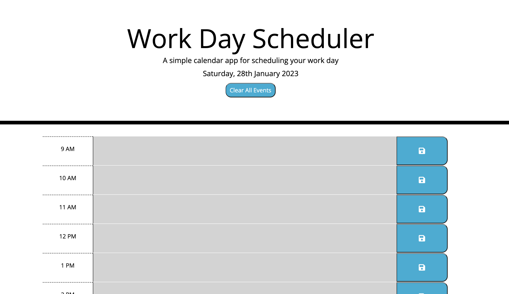

# Work-Day-Scheduler
A project to create an event scheduler for a typical 9-5 work day.

## Description

### Purpose
The purpose of this project was to understand how to use third party APIs such as jQuery to speed up the development process.

The task was to create an application that allows a user to schedule events during their work day:
- Display the current day at the top of the calender when a user opens the planner (used moment.js library to handle dates)
- Present timeblocks for standard business hours when the user scrolls down.
- Color-code each timeblock based on past, present, and future when the timeblock is viewed.
- Allow a user to enter an event when they click a timeblock
- Save the event in local storage when the save button is clicked in that timeblock.
- Persist events between refreshes of a page
    
- Extra: I added a clear events button for completeness. If a user did use this regularly, clearing events would be useful.

What I Learned:
- jQuery is a very useful third party API and has a lot of useful functionality but it's key to read the documentation and understand how or why you might use jQuery over vanilla JS for a specific use case.
- There are a lot of useful library's, such as Moment out there that will save time and handle some of the more involved aspects of javaScript with ease.

[Project Website](https://nailahmukhtar.github.io/Work-Day-Scheduler).

## Usage
To view this in action, you can navigate to my [Project Website](https://nailahmukhtar.github.io/Work-Day-Scheduler).

## Credits
Assignment provided by © 2022 edX Boot Camps LLC

## License
Not Applicable.
